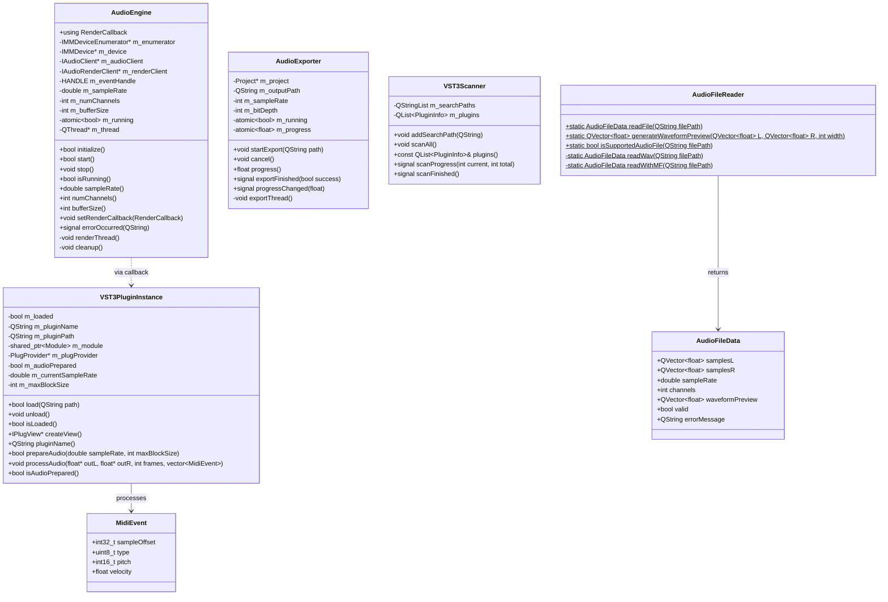
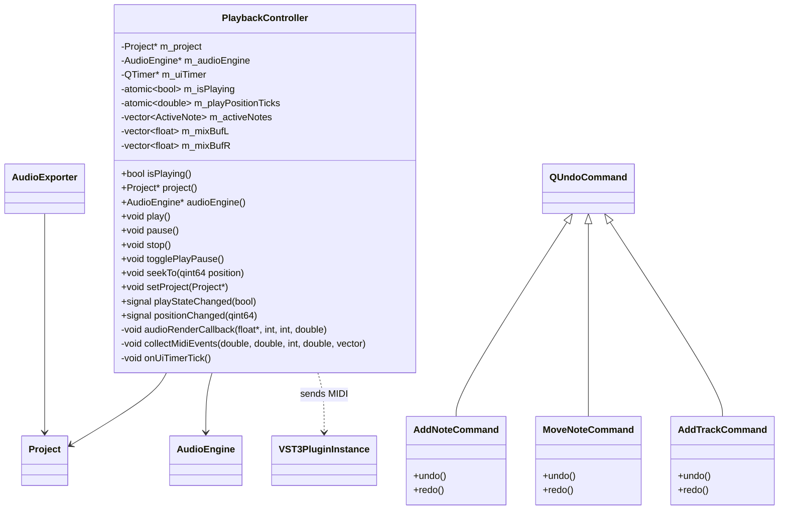
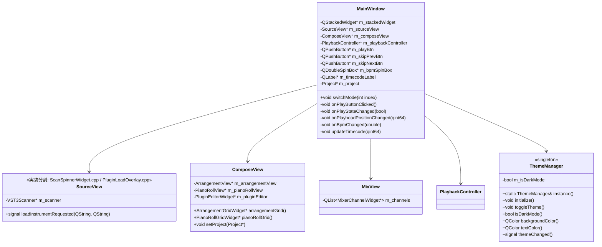

# Darwin DAW - クラス図

## 1. モデル層クラス図

```mermaid
classDiagram
    class Project {
        +static TICKS_PER_BEAT = 480
        +static DEFAULT_BPM = 128
        -QString m_name
        -double m_bpm
        -qint64 m_playheadPosition
        -QList~Track*~ m_tracks
        +QString name()
        +double bpm()
        +void setBpm(double)
        +qint64 playheadPosition()
        +void setPlayheadPosition(qint64)
        +const QList~Track*~& tracks()
        +Track* addTrack(QString name)
        +Track* addFolderTrack(QString name)
        +void removeTrack(Track*)
        +Track* trackAt(int index)
        +Track* trackById(int id)
        +void addTrackToFolder(Track* track, Track* folder)
        +void removeTrackFromFolder(Track*)
        +void moveFolderBlock(Track* folder, int toFlatIndex)
        +QList~Track*~ folderChildren(Track*)
        +bool isTrackVisibleInHierarchy(Track*)
        +qint64 ticksToMs(qint64)
        +qint64 msToTicks(qint64)
        +double ticksToBeats(qint64)
        +qint64 beatsToTicks(double)
        +signal trackAdded(Track*)
        +signal trackRemoved(Track*)
        +signal trackOrderChanged()
        +signal folderStructureChanged()
        +signal playheadChanged(qint64)
        +signal bpmChanged(double)
        +signal exportRangeChanged()
        +signal flagsChanged()
        +signal modified()
        +const QList~qint64~& flags()
        +void addFlag(qint64 tickPosition)
        +void removeFlag(qint64 tickPosition)
        +void clearFlags()
        +bool hasFlag(qint64 tickPosition)
        +qint64 nextFlag(qint64 currentTick)
        +qint64 prevFlag(qint64 currentTick)
    }

    class Track {
        -int m_id
        -QString m_name
        -QString m_instrumentName
        -bool m_visible
        -bool m_muted
        -bool m_solo
        -double m_volume
        -double m_pan
        -QColor m_color
        -bool m_isFolder
        -int m_parentFolderId
        -bool m_folderExpanded
        -QList~Clip*~ m_clips
        -VST3PluginInstance* m_pluginInstance
        +int id()
        +QString name()
        +bool isMuted()
        +bool isSolo()
        +double volume()
        +double pan()
        +QColor color()
        +VST3PluginInstance* pluginInstance()
        +bool hasPlugin()
        +bool isFolder()
        +int parentFolderId()
        +bool isFolderExpanded()
        +void setIsFolder(bool)
        +void setParentFolderId(int)
        +void setFolderExpanded(bool)
        +Clip* addClip(qint64 start, qint64 duration)
        +void removeClip(Clip*)
        +bool loadPlugin(QString path)
        +void unloadPlugin()
        +signal clipAdded(Clip*)
        +signal clipRemoved(Clip*)
        +signal propertyChanged()
    }

    class ClipType {
        <<enumeration>>
        Midi
        Audio
    }

    class Clip {
        -int m_id
        -qint64 m_startTick
        -qint64 m_durationTicks
        -ClipType m_clipType
        -QList~Note*~ m_notes
        -QString m_audioFilePath
        -QVector~float~ m_audioSamplesL
        -QVector~float~ m_audioSamplesR
        -double m_audioSampleRate
        -QVector~float~ m_waveformPreview
        +qint64 startTick()
        +qint64 endTick()
        +void setStartTick(qint64)
        +qint64 durationTicks()
        +void setDurationTicks(qint64)
        +ClipType clipType()
        +bool isAudioClip()
        +bool isMidiClip()
        +Note* addNote(int pitch, qint64 start, qint64 duration, int velocity)
        +void removeNote(Note*)
        +bool loadAudioFile(QString filePath, double projectSampleRate)
        +void setAudioData(QVector~float~ L, QVector~float~ R, double sr, QString path)
        +QString audioFilePath()
        +const QVector~float~& audioSamplesL()
        +const QVector~float~& audioSamplesR()
        +double audioSampleRate()
        +const QVector~float~& waveformPreview()
        +signal noteAdded(Note*)
        +signal noteRemoved(Note*)
        +signal changed()
    }

    Clip --> ClipType : has

    class Note {
        -int m_pitch
        -qint64 m_startTick
        -qint64 m_durationTicks
        -int m_velocity
        +int pitch()
        +void setPitch(int)
        +qint64 startTick()
        +void setStartTick(qint64)
        +qint64 durationTicks()
        +void setDurationTicks(qint64)
        +int velocity()
        +void setVelocity(int)
        +qint64 endTick()
        +QString pitchName()
        +signal changed()
    }

    Project "1" --> "*" Track : contains
    Track "1" --> "*" Clip : contains
    Track "1" --> "0..1" VST3PluginInstance : owns
    Clip "1" --> "*" Note : contains (MIDI)
    Clip "1" --> "0..1" AudioFileData : holds (Audio)
```

## 2. オーディオ・プラグイン層クラス図

```mermaid
classDiagram
    class AudioEngine {
        +using RenderCallback
        -IMMDeviceEnumerator* m_enumerator
        -IMMDevice* m_device
        -IAudioClient* m_audioClient
        -IAudioRenderClient* m_renderClient
        -HANDLE m_eventHandle
        -double m_sampleRate
        -int m_numChannels
        -int m_bufferSize
        -atomic~bool~ m_running
        -QThread* m_thread
        +bool initialize()
        +bool start()
        +void stop()
        +bool isRunning()
        +double sampleRate()
        +int numChannels()
        +int bufferSize()
        +void setRenderCallback(RenderCallback)
        +signal errorOccurred(QString)
        -void renderThread()
        -void cleanup()
    }

    class AudioExporter {
        -Project* m_project
        -QString m_outputPath
        -int m_sampleRate
        -int m_bitDepth
        -atomic~bool~ m_running
        -atomic~float~ m_progress
        +void startExport(QString path)
        +void cancel()
        +float progress()
        +signal exportFinished(bool success)
        +signal progressChanged(float)
        -void exportThread()
    }

    class VST3PluginInstance {
        -bool m_loaded
        -QString m_pluginName
        -QString m_pluginPath
        -shared_ptr~Module~ m_module
        -PlugProvider* m_plugProvider
        -bool m_audioPrepared
        -double m_currentSampleRate
        -int m_maxBlockSize
        +bool load(QString path)
        +void unload()
        +bool isLoaded()
        +IPlugView* createView()
        +QString pluginName()
        +bool prepareAudio(double sampleRate, int maxBlockSize)
        +void processAudio(float* outL, float* outR, int frames, vector~MidiEvent~)
        +bool isAudioPrepared()
    }

    class VST3Scanner {
        -QStringList m_searchPaths
        -QList~PluginInfo~ m_plugins
        +void addSearchPath(QString)
        +void scanAll()
        +const QList~PluginInfo~& plugins()
        +signal scanProgress(int current, int total)
        +signal scanFinished()
    }

    class MidiEvent {
        +int32_t sampleOffset
        +uint8_t type
        +int16_t pitch
        +float velocity
    }

    class AudioFileReader {
        +static AudioFileData readFile(QString filePath)$
        +static QVector~float~ generateWaveformPreview(QVector~float~ L, QVector~float~ R, int width)$
        +static bool isSupportedAudioFile(QString filePath)$
        -static AudioFileData readWav(QString filePath)$
        -static AudioFileData readWithMF(QString filePath)$
    }

    class AudioFileData {
        +QVector~float~ samplesL
        +QVector~float~ samplesR
        +double sampleRate
        +int channels
        +QVector~float~ waveformPreview
        +bool valid
        +QString errorMessage
    }

    AudioFileReader --> AudioFileData : returns
    VST3PluginInstance --> MidiEvent : processes
    AudioEngine ..> VST3PluginInstance : via callback
```

## 3. コントローラー層クラス図

```mermaid
classDiagram
    class PlaybackController {
        -Project* m_project
        -AudioEngine* m_audioEngine
        -QTimer* m_uiTimer
        -atomic~bool~ m_isPlaying
        -atomic~double~ m_playPositionTicks
        -vector~ActiveNote~ m_activeNotes
        -vector~float~ m_mixBufL
        -vector~float~ m_mixBufR
        +bool isPlaying()
        +Project* project()
        +AudioEngine* audioEngine()
        +void play()
        +void pause()
        +void stop()
        +void togglePlayPause()
        +void seekTo(qint64 position)
        +void setProject(Project*)
        +signal playStateChanged(bool)
        +signal positionChanged(qint64)
        -void audioRenderCallback(float*, int, int, double)
        -void collectMidiEvents(double, double, int, double, vector)
        -void onUiTimerTick()
    }

    PlaybackController --> Project
    PlaybackController --> AudioEngine
    PlaybackController ..> VST3PluginInstance : sends MIDI
    AudioExporter --> Project

    class AddNoteCommand {
        +undo()
        +redo()
    }
    class MoveNoteCommand {
        +undo()
        +redo()
    }
    class AddTrackCommand {
        +undo()
        +redo()
    }

    QUndoCommand <|-- AddNoteCommand
    QUndoCommand <|-- MoveNoteCommand
    QUndoCommand <|-- AddTrackCommand
```

## 4. ビュー層クラス図

```mermaid
classDiagram
    class MainWindow {
        -QStackedWidget* m_stackedWidget
        -SourceView* m_sourceView
        -ComposeView* m_composeView
        -PlaybackController* m_playbackController
        -QPushButton* m_playBtn
        -QPushButton* m_skipPrevBtn
        -QPushButton* m_skipNextBtn
        -QDoubleSpinBox* m_bpmSpinBox
        -QLabel* m_timecodeLabel
        -Project* m_project
        +void switchMode(int index)
        -void onPlayButtonClicked()
        -void onPlayStateChanged(bool)
        -void onPlayheadPositionChanged(qint64)
        -void onBpmChanged(double)
        -void updateTimecode(qint64)
    }

    class SourceView {
        <<実装分割: ScanSpinnerWidget.cpp / PluginLoadOverlay.cpp>>
        -VST3Scanner* m_scanner
        +signal loadInstrumentRequested(QString, QString)
    }

    class ComposeView {
        -ArrangementView* m_arrangementView
        -PianoRollView* m_pianoRollView
        -PluginEditorWidget* m_pluginEditor
        +ArrangementGridWidget* arrangementGrid()
        +PianoRollGridWidget* pianoRollGrid()
        +void setProject(Project*)
    }

    class MixView {
        -QList~MixerChannelWidget*~ m_channels
    }

    class ThemeManager {
        <<singleton>>
        -bool m_isDarkMode
        +static ThemeManager& instance()
        +void initialize()
        +void toggleTheme()
        +bool isDarkMode()
        +QColor backgroundColor()
        +QColor textColor()
        +signal themeChanged()
    }

    MainWindow --> SourceView
    MainWindow --> ComposeView
    MainWindow --> MixView
    MainWindow --> PlaybackController
    MainWindow --> ThemeManager
```

## 5. ウィジェット層クラス図

```mermaid
classDiagram
    class ArrangementGridWidget {
        <<実装分割: _Painting / _Input / _DragDrop / _Animation>>
        -qint64 m_playheadPosition
        -Project* m_project
        -int m_selectedClipId
        -bool m_isDragging
        -bool m_isResizing
        +void setProject(Project*)
        +void setPlayheadPosition(qint64)
        +signal clipSelected(Clip*)
        #void paintEvent(QPaintEvent*)
        #void mousePressEvent(QMouseEvent*)
        #void mouseMoveEvent(QMouseEvent*)
        #void mouseReleaseEvent(QMouseEvent*)
        #void mouseDoubleClickEvent(QMouseEvent*)
    }

    class PianoRollGridWidget {
        <<実装分割: _Painting / _Input>>
        -qint64 m_playheadPosition
        -Clip* m_activeClip
        -Project* m_project
        -double m_zoomLevel
        -Note* m_selectedNote
        -bool m_isDragging
        -bool m_isResizing
        +void setPlayheadPosition(qint64)
        +void setActiveClip(Clip*)
        +void setProject(Project*)
        #void paintEvent(QPaintEvent*)
        #void mousePressEvent(QMouseEvent*)
        #void wheelEvent(QWheelEvent*)
    }

    class VelocityLaneWidget {
        -Clip* m_clip
        #void paintEvent(QPaintEvent*)
        #void mousePressEvent(QMouseEvent*)
    }

    class PluginEditorWidget {
        -IPlugView* m_plugView
        -IPlugFrame* m_plugFrame
        -QWidget* m_container
        -QWidget* m_offscreenHost
        -ScaledPluginDisplay* m_scaledDisplay
        -double m_scaleFactor
        -int m_nativeWidth
        -int m_nativeHeight
        -bool m_bitmapCaptureActive
        +bool openEditor(VST3PluginInstance*)
        +void closeEditor()
        +void capturePluginView()
        -void updateScaleMode()
        -void enterDirectMode()
        -void enterBitmapCaptureMode()
    }

    class MixerChannelWidget {
        -KnobWidget* m_panKnob
        -FaderWidget* m_fader
        -LevelMeterWidget* m_meter
        +void setVolume(double)
        +void setPan(double)
    }

    class FaderWidget {
        -double m_value
        +signal valueChanged(double)
    }

    class LevelMeterWidget {
        -float m_level
        +void setLevel(float)
    }

    class TimelineWidget {
        -Project* m_project
        -QScrollArea* m_gridScroll
        -QTimer m_longPressTimer
        -QPointF m_longPressPos
        -bool m_longPressActive
        -bool m_longPressFired
        +void setProject(Project*)
        +void syncWidthToGrid(int)
        -void drawFlags(QPainter&)
        -void onLongPress()
    }

    class KnobWidget {
        -QString m_label
        -float m_value
        -float m_minValue
        -float m_maxValue
        +void setValue(float)
        +float value()
        +signal valueChanged(float)
    }

    class CustomTooltip {
        +static showText(QPoint, QString)
        +static hideText()
        +static attach(QWidget*)
        -QPropertyAnimation* m_fadeAnim
        -QTimer* m_hideTimer
        #bool eventFilter(QObject*, QEvent*)
    }

    MixerChannelWidget --> KnobWidget
    MixerChannelWidget --> FaderWidget
    MixerChannelWidget --> LevelMeterWidget
    ArrangementView --> TimelineWidget
```
