# Darwin DAW - データフロー図

## 1. 再生時のデータフロー（オーディオエンジン統合）

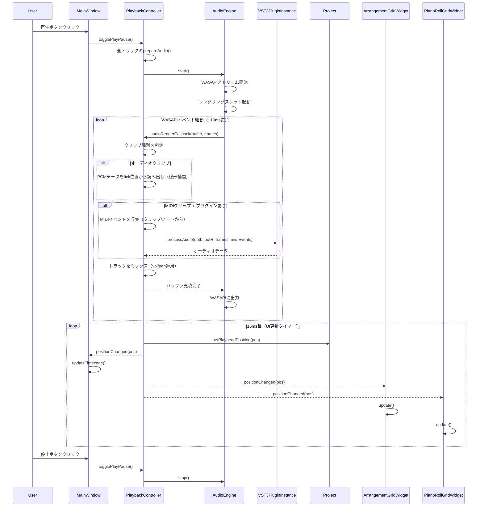

## 2. プラグインロード・GUI表示のデータフロー

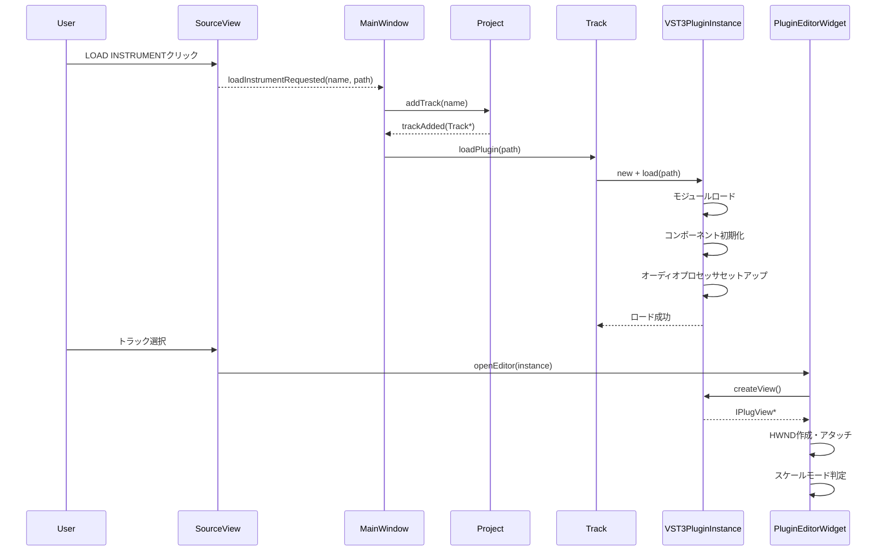

## 3. ノート作成のデータフロー

```mermaid
sequenceDiagram
    participant User
    participant PianoRollGridWidget
    participant Clip
    participant Note

    User->>PianoRollGridWidget: ダブルクリック
    PianoRollGridWidget->>PianoRollGridWidget: 描画位置からpitch, start計算
    PianoRollGridWidget->>Clip: addNote(pitch, start, duration, velocity)
    Clip->>Note: new Note(...)
    Clip-->>PianoRollGridWidget: noteAdded(note)
    PianoRollGridWidget->>PianoRollGridWidget: update()
```

## 4. クリップ操作のデータフロー

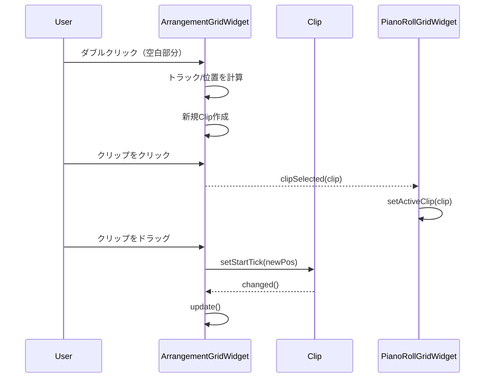

## 5. オーディオレンダリングの詳細フロー

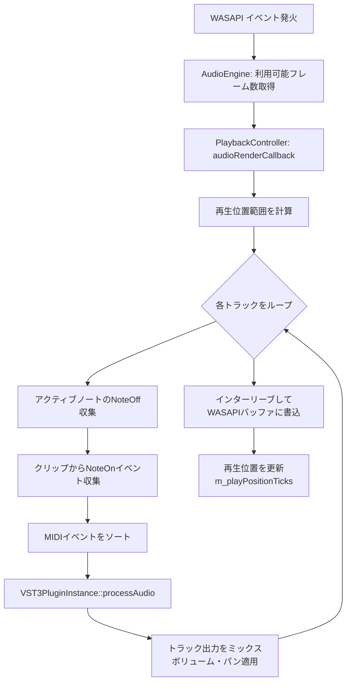

## 6. ビュー間の同期

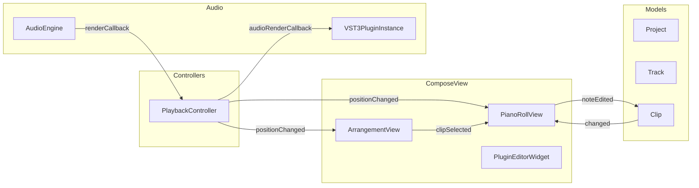

## 7. シグナル接続一覧

| 発行元 | シグナル | 受信先 | スロット |
|--------|----------|--------|----------|
| `PlaybackController` | `playStateChanged(bool)` | `MainWindow` | `onPlayStateChanged()` |
| `PlaybackController` | `positionChanged(qint64)` | `MainWindow` | `onPlayheadPositionChanged()` |
| `PlaybackController` | `positionChanged(qint64)` | `ArrangementGridWidget` | `setPlayheadPosition()` |
| `PlaybackController` | `positionChanged(qint64)` | `PianoRollGridWidget` | `setPlayheadPosition()` |
| `ArrangementGridWidget` | `clipSelected(Clip*)` | `PianoRollGridWidget` | `setActiveClip()` |
| `SourceView` | `loadInstrumentRequested(QString, QString)` | `MainWindow` | (lambda) |
| `Project` | `trackAdded(Track*)` | 複数 | `update()` |
| `Track` | `propertyChanged()` | `ArrangementGridWidget` | `update()` |
| `Clip` | `noteAdded(Note*)` | `PianoRollGridWidget` | `update()` |
| `Clip` | `noteRemoved(Note*)` | `PianoRollGridWidget` | `update()` |
| `QDoubleSpinBox` | `valueChanged(double)` | `MainWindow` | `onBpmChanged()` |
| `Project` | `flagsChanged()` | `TimelineWidget` | `update()` |
| `Project` | `flagsChanged()` | `TimelineWidget` | `update()` |
| `MainWindow (skipPrevBtn)` | `clicked()` | `PlaybackController` | `seekTo(prevFlag)` |
| `MainWindow (skipNextBtn)` | `clicked()` | `PlaybackController` | `seekTo(nextFlag)` |
| `ThemeManager` | `themeChanged()` | 複数 | 各UIのスタイル更新・再描画 |

## 8. Undo/Redo のデータフロー

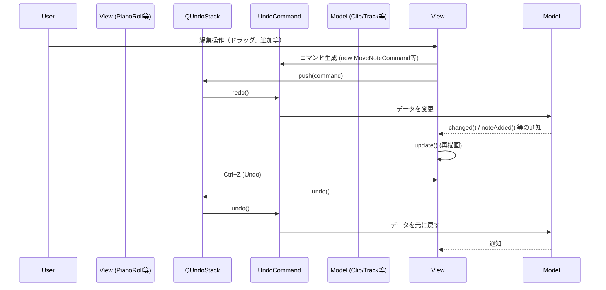

## 9. オーディオエクスポートのデータフロー

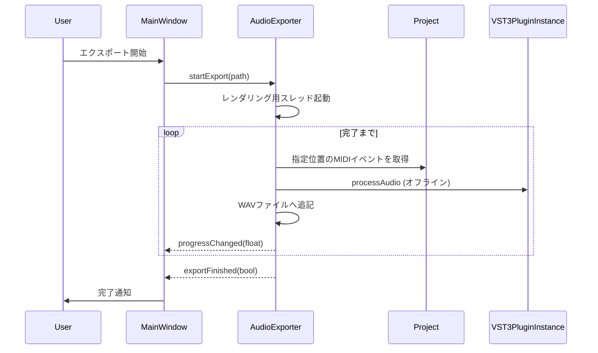

## 10. フラッグ（マーカー）操作のデータフロー

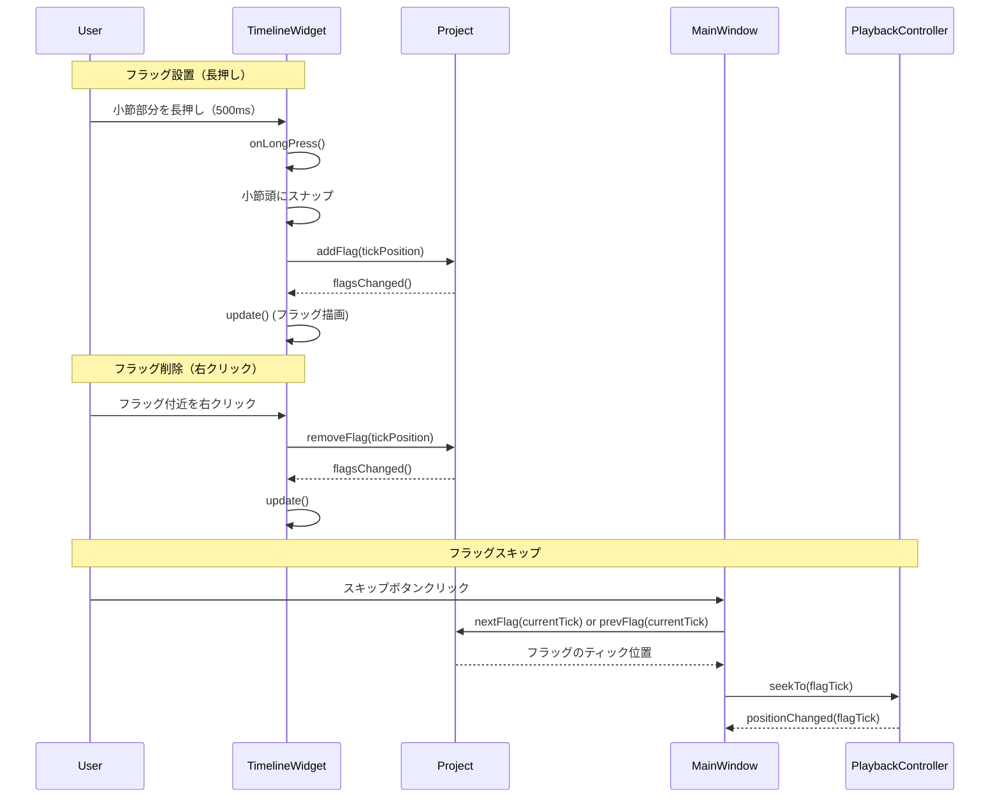

## 11. オーディオファイルインポートのデータフロー

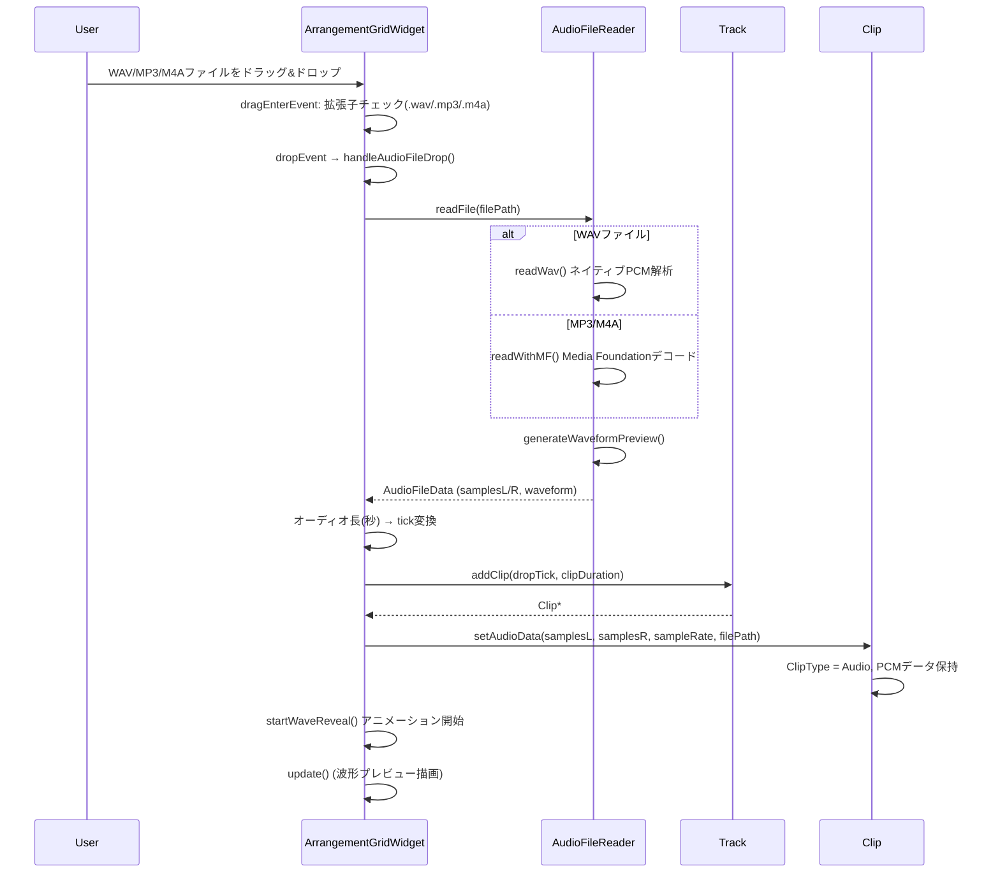

## 12. オーディオクリップ再生時の詳細フロー

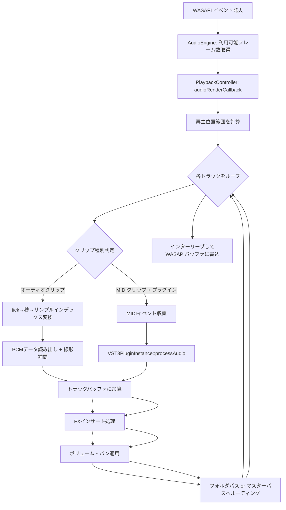

## 6. テーマ切り替えのデータフロー

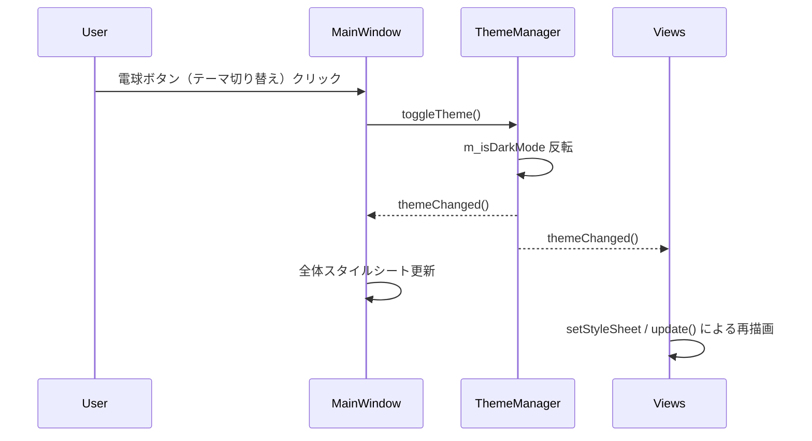
